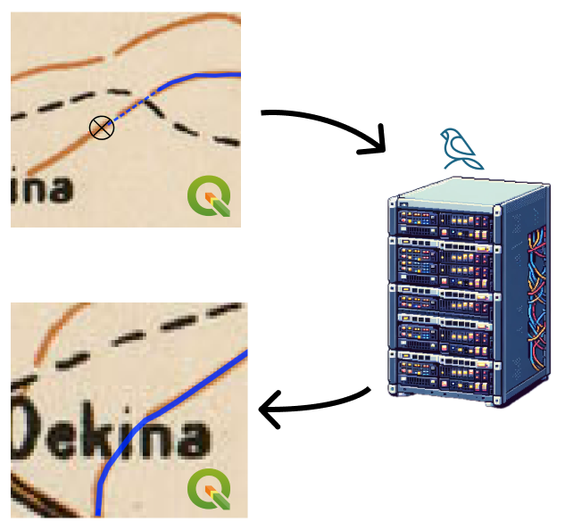

# AI Vectorizer for QGIS

This QGIS plugin uses machine learning to automatically vectorize lines and polygons from raster maps. It lets you digitize old raster maps more quickly, even for skilled GIS users.

You can use the plugin by starting features as you would, except with the AI
Vectorizer activated instead of the Add Line Feature tool. The plugin will autocomplete
ahead of you. If it makes a mistake, you can hold down `shift` to cut and then add
vertices without autocomplete, before returning back to autocomplete mode.

### Network Usage

Because the plugin uses a hosted AI to autocomplete tracing maps, context around
the cursor (raster layers) is sent to Bunting Labs servers, and the vector output
is returned.

### License

This repository is licensed under the GNU GPLv2.
